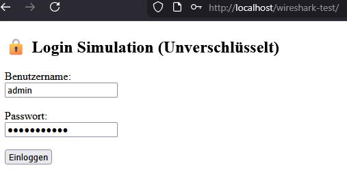
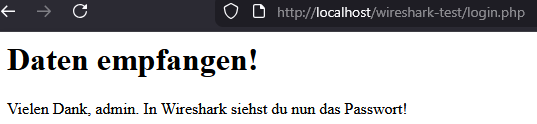
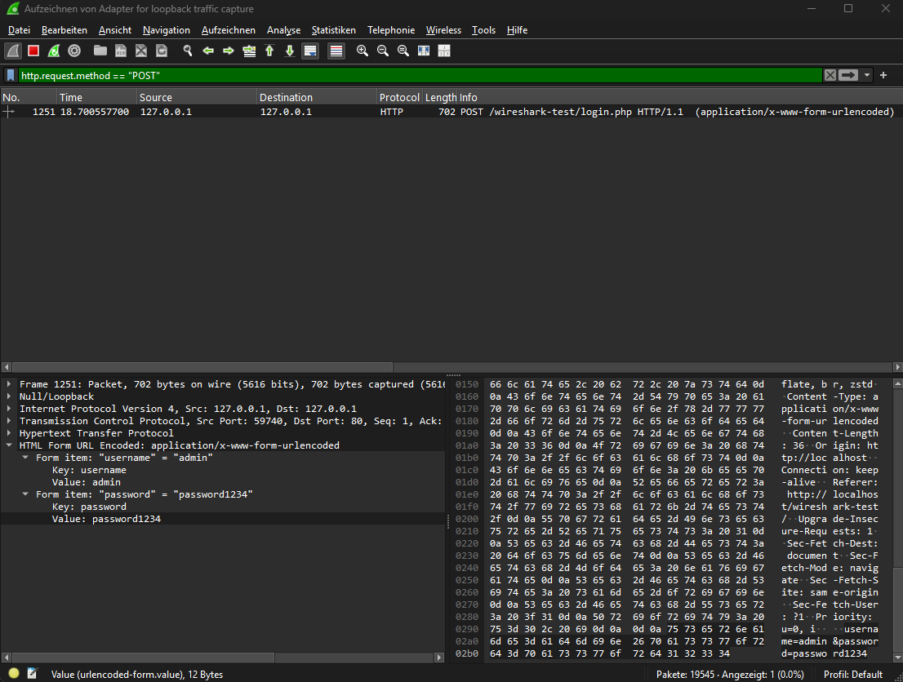
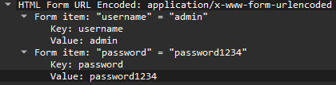
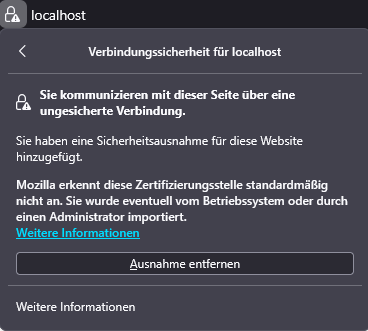
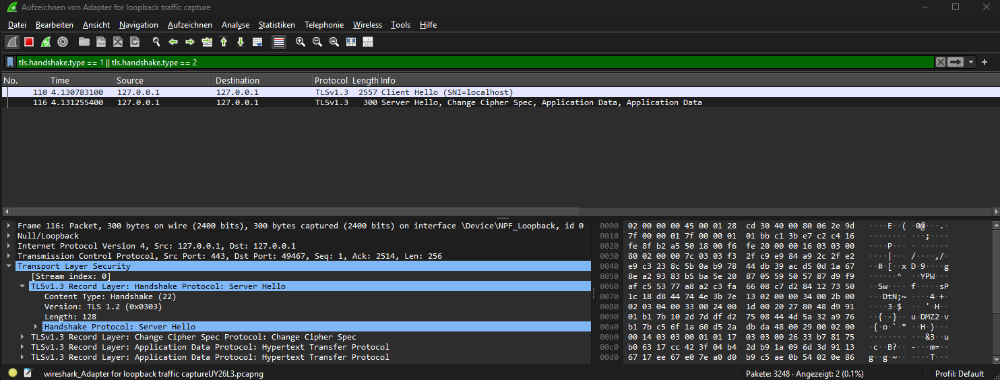

# 🔐 Network Traffic Analysis: From Plaintext Leaks to TLS 1.3 Hardening

This project demonstrates the critical security risks of unencrypted communication and the subsequent remediation using modern cryptographic standards. It features a complete workflow from intercepting credentials to securing a local environment using **Wireshark**, **OpenSSL**, and **XAMPP**.

---

## 📌 Objective
The goal is to show how sensitive information (usernames/passwords) is transmitted in **plain text** over standard HTTP, making it vulnerable to interception, and how to effectively mitigate this using **SSL/TLS**.

## ⚙️ Environment & Tools
* **Packet Analyzer:** Wireshark 4.6.4
* **Local Server:** Apache (via XAMPP)
* **Encryption:** OpenSSL (RSA-2048)
* **Capture Interface:** Npcap Loopback Adapter (127.0.0.1)
* **Lab Files:** Custom HTML/PHP login form (included in `/src`)

---

## 🧪 Methodology
1. **Lab Setup:** Deployed a local Apache server using XAMPP to host a non-HTTPS login page.
2. **Traffic Capture:** Initiated a capture on the **Npcap Loopback Adapter** to intercept localhost traffic.
3. **Simulation:** Performed a login attempt with dummy credentials.
4. **Analysis:** Filtered traffic using `http.request.method == "POST"` and inspected the payload.
5. **Hardening:** Implemented SSL/TLS and verified encryption via Port 443.

---

## 🔍 Part 1: Vulnerability Research (The Attack)
In this phase, I analyzed standard HTTP traffic to identify how sensitive data is transmitted in an unencrypted environment.

### 1. User Interface & Interaction
The simulation begins with a standard login form. Note the **"Not Secure"** warning in the browser's address bar.

| Login Interface | Post-Login Response |
| :--- | :--- |
|  |  |
| *Entering credentials (`admin` / `password1234`)* | *Server confirmation via `login.php`* |

<em>Figure 1: Laboratory UI and workflow.</em>

### 2. Identifying the POST Request
By filtering for HTTP POST methods in Wireshark, I isolated the exact moment the login data was transmitted.

<em>Figure 2: Wireshark display filter isolates the login packet.</em>

### 3. Credential Extraction (The "Smoking Gun")
Since no encryption was used, the password is fully visible in plain text within the HTTP payload.

  

<em>Figure 3: Detailed view showing 'admin' and 'password1234' in the clear.</em>

---

## 🛡️ Part 2: Security Hardening (The Remediation)
After identifying the risk, I implemented **SSL/TLS encryption** to secure the communication channel.

### 4. Implementation of SSL/TLS
I generated a self-signed RSA 2048-bit certificate using **OpenSSL** and reconfigured Apache to enforce secure connections.

* **Certificate Subject:** `O=Renatoissance, CN=localhost`
* **Encryption Standard:** RSA-2048 / SHA-256
* **Protocol:** TLS 1.3 (Modern Standard)
* **Note on Trust:** Browsers correctly flag the connection as "Not Secure" (see Fig. 4a) because the certificate is **self-signed**. While the identity isn't verified by a public CA, the **cryptographic tunnel** is fully functional.

| Browser Trust Warning | Certificate Details |
| :---: | :---: |
|  |  |
| *Figure 4a: Mozilla trust alert (Self-signed).* | *Figure 4b: RSA-2048 certificate for 'localhost'.* |

### 5. Final Verification: Encrypted Traffic
To verify the fix, I re-captured the login process. The difference in the network layer is absolute:

* **The Handshake:** Wireshark confirms a successful `Server Hello` using **TLS 1.3**. (Note: The Record Layer may show "1.2" for middlebox compatibility, but the handshake negotiates 1.3).
* **Data Protection:** Credentials are now hidden within **"Encrypted Application Data"**.

  

<em>Figure 5: Wireshark confirms that all sensitive data is now protected by TLS 1.3.</em>

---

## 📁 Resources & Lab Files
* **[Packet Capture](./capture):** Raw `.pcapng` data for both HTTP and TLS captures.
* **[Source Code](./src/):** Unencrypted HTML/PHP files used in the lab.

---

## 🛡️ Security Implications & Mitigation
* **Encryption:** Use **HTTPS** (TLS) to encrypt data in transit.
* **Integrity:** TLS prevents unauthorized modification (Tampering) of packets.
* **Best Practice:** Never transmit sensitive data over unencrypted channels (CWE-319).

## 📊 Skills Demonstrated
* Network Protocol Analysis (HTTP, TCP/IP, TLS 1.3)
* Wireshark Proficiency (Deep Packet Inspection & Filtering)
* Infrastructure Hardening (SSL/TLS Configuration & OpenSSL)
* Security Vulnerability Identification & Remediation

---

⚠️ **Disclaimer:** This project was conducted in a 100% legal, local environment (localhost). It is strictly for educational purposes to demonstrate network security principles.
